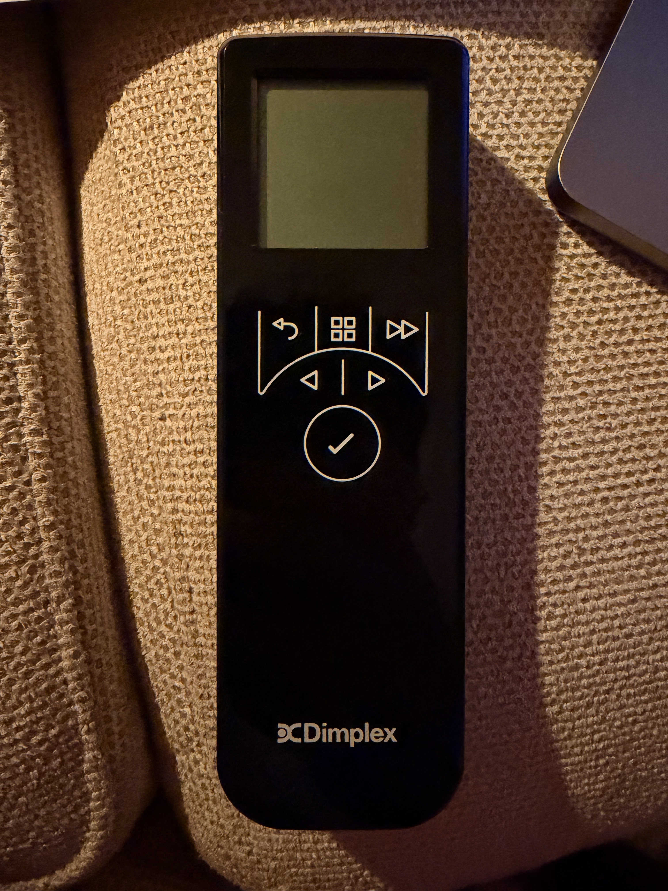

# Dimplex Opti‑myst Cassette (CAS400LNH) BLE protocol

Reverse‑engineered from a Dimplex Opti‑myst Cassette 400 (`CAS400LNH`) and its
Bluetooth remote. This is the **older** Glen Dimplex BLE generation; the current
Dimplex *Flame Connect* / Faber *ITC* apps speak a different, newer protocol and do
**not** work with this fire (see [Generations](#dimplex-ble-generations)).



## Device identity

| | |
|---|---|
| Model | Dimplex Opti‑myst Cassette 400, `CAS400LNH` |
| Advertised name | `FI0514<Dimplex>` |
| BLE address | `00:A0:50:D6:A5:14` (public; OUI `00:A0:50` = Cypress/Infineon) |
| Firmware (reg `0x0095`) | `EP4120` |
| Serial (reg `0x009b`) | `F000B540` |
| Custom service | `00060000-F8CE-11E4-ABF4-0002A5D5C51C` |
| “Known” characteristic | `00060001-…` (value handle `0x00A2`, props NOTIFY/WRITE) — **not** the control channel |

## Pairing / security  🔑

The remote and fire perform **LE Legacy pairing, Passkey Entry, MITM required**
(initiator IO cap = KeyboardDisplay, responder = DisplayOnly). Neither device has a
keypad/display, so the passkey is **fixed in firmware**.

- **Passkey = `584936`** (confirmed identical across two independent pairings on this unit).
- Encryption is **mandatory**: control attributes return `0x05 INSUF_AUTHENTICATION`
  until the link is MITM‑encrypted. **You cannot replay raw writes — you must pair.**
- The fire shows `NOT BONDED` and re‑pairs each connection (no stored LTK), which is
  what makes the passkey crackable offline.

### Finding your passkey

If `584936` doesn't pair your unit, crack it from a sniffed pairing:

1. Sniff a remote→fire pairing with an nRF52840 + Wireshark (nRF Sniffer). You need the
   full handshake: Pairing Req/Rsp, both Confirm, both Random.
2. `crackle -i capture.pcapng -o decrypted.pcap` →
   prints `TK found: NNNNNN` (your passkey) and decrypts the session.
3. (`tools/crack_and_parse.sh` automates crackle + ATT decode.)

## GATT control — write/read raw handles

The remote talks to **raw attribute handles** (it knows them a priori). The fire exposes
~74 attributes; vendor 16‑bit UUIDs fall into families: `0x10xx` (config/limits), `0x40xx`
(flame/feature controls), `0x20xx` (device info: name/model/serial), plus standard GAP.

### Confirmed registers

| Handle | UUID | Meaning | Values |
|---|---|---|---|
| `0x0040` | `0x4008` | **Power on/off** (byte 1); **low‑water latch** (byte 2) | b1: `00`=off, `06`=on · b2: `00`=ok, `01`=needs‑water |
| `0x0042` | `0x4009` | **Flame level** (write here to set level) | `01`–`06` |
| `0x0076` | `0x4010` | **Volume / sound** | `00`=off, `01`–`06` |
| `0x0010` | `0x0006` | **Clock** (7 bytes) | `YYh YYl MM DD HH MM SS` e.g. `14 1a 06 0e 17 18 01` = 2026‑06‑14 23:24:01 |
| `0x0012` | `0x0106` | **Clock + extra byte** (8 bytes) | as above + trailing byte (DST / day‑of‑week) |
| `0x0063` | `0x4004` | resulting flame intensity % (read‑only effect of the level) | byte 2: `0x64`=100 % @L6, `0x34`=52 % @L2 |
| `0x005d` | `0x4000` | on + intensity (tracks power) | `01 64` when on |

**Setting the flame:** `0x0040` is on/off ONLY (`0x06`/`0x00`); the **1–6 level is a separate
register, `0x0042`**. Writing the level into `0x0040` does NOT work (only `0x06`/`0x00` are
valid there) — set power via `0x0040`, then the level via `0x0042`. (Confirmed by diffing the
remote's flame‑up/down against a register dump.)

### Per‑connection session init (replayed by the remote, and by this firmware)

After pairing, before commands, the remote writes:

```
WRITE 0x0012 = 14 13 01 01 00 .. .. ..   (clock/handshake; last bytes vary per session)
WRITE 0x0087 = 01 01 00
WRITE 0x0087 = 00 00 00
```

This firmware replays these on connect; control writes to `0x0040` are honoured after.

### Low‑water flag

Byte 2 of `0x0040` is a **latched** low‑water warning: it trips when the mist runs the
water low, **stays set through a refill**, and clears only on a **mains power‑cycle**
(matches the manual: empty tank → effect stops + 2 beeps). Because it's latched, it can't
report “needs water *right now*”, so this project doesn't expose it as a sensor. A *live*
water level may live in one of the read‑only `0x10xx` sensor registers (unmapped).

## Methodology

1. **Sniff** remote↔fire with nRF52840 (Wireshark nRF Sniffer). Critical gotcha: you must
   **select the fire in the “Device” dropdown while it's advertising (remote idle)** so the
   sniffer *follows* the connection — otherwise you only get advertising packets.
2. **Crack + decrypt** the LE‑legacy pairing with `crackle` → readable ATT writes.
3. For mapping individual settings, the **ESP register‑diff** method proved far more
   reliable than sniffing the remote's brief connections: dump all registers, change one
   setting on the remote (ESP disconnected), dump again, diff. (See `Dimplex_Dump`.)

## Dead‑ends (so you don't repeat them)

- **Raw replay / fireplace emulation:** impossible — control is behind authenticated
  encryption. Cloning advertising/the service is not enough; the remote shows `NO PROD`.
- **ESPHome `ble_client`:** compiles and pairs, but its GATT layer never achieved an
  authenticated link for our writes — out‑of‑band `esp_ble_set_encryption` isn't tracked
  (ops → `INSUF_AUTH 0x05`), and op‑driven `AUTH_REQ_MITM` gave transient `AUTH_FAIL 0x89`;
  writes never landed. Abandoned in favour of an Arduino + NimBLE bridge.
- **Bluedroid (Arduino `BLEDevice`) + Wi‑Fi:** crashes (`xQueueGenericSend` null‑queue
  assert) when both radios run together. **NimBLE** is the fix — lighter, coexists cleanly,
  and achieves a proper MITM‑authenticated link.
- Raw `esp_ble_gattc_*` layered on top of `BLEDevice` returns OK but silently no‑ops; go
  fully through one BLE stack's client API.

## Dimplex BLE generations

| Generation | Service | Mechanism | App |
|---|---|---|---|
| **This fire (CAS400LNH)** | `00060000-f8ce-11e4-…` | paired (MITM passkey), raw‑handle GATT | none (predates the apps) |
| Newer Dimplex/Faber | `713d0000-503e-4c75-…` | GATT, e.g. BrightnessUp/Down, Boost | *Flame Connect* (`com.Dimplex.Fires`), *Faber ITC V2* |
| Optimyst “Penngrove” | n/a | plaintext **advertising** commands (“Optimyst” prefix), no pairing | — |

Decompiling *Flame Connect* (.NET MAUI) and *Faber ITC V2* (Xamarin) confirmed they use
the `713d…` service and contain nothing for `f8ce…`, i.e. this fire's protocol is
undocumented anywhere public.
